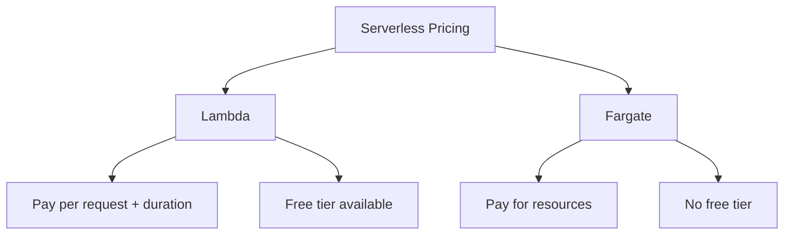

```table-of-contents
title: 
style: nestedList # TOC style (nestedList|nestedOrderedList|inlineFirstLevel)
minLevel: 0 # Include headings from the specified level
maxLevel: 2 # Include headings up to the specified level
includeLinks: true # Make headings clickable
debugInConsole: false # Print debug info in Obsidian console
```
(disregard this, it's a table of contents when viewed in Obsidian)
# Getting your head in the Cloud
## What is the cloud?
- Decentralized server architecture
- Data centers divided into slices using virtualization
	- Virtualization cost is gauged like an electric meter
		- On-demand
		- Pay-as-you-go
## What is cloud computing?
- Using the internet to deliver computing services
	- Rather than an internal data center or local machine
## Types of services AWS offers	
*For more information, go to [Overview of Amazon Web Services ](https://docs.aws.amazon.com/pdfs/whitepapers/latest/aws-overview/aws-overview.pdf)*
- Compute
- Storage
- Networking
- Database
- Developing
- Migration
- Artificial Intelligence
- Auditing
- Security
- Pricing
## Exam Tips
- Learn the different service categories
- Read the whitepaper linked above

# Cloud Computing and Deployment Models
## CapEx vs. OpEx
- Capital Expenditures
	- Upfront purchases towards fixed assets
		- E.g. datacenter, office building, company vehicle
- Operating Expenses
	- Funds used to run day-to-day operations
		- E.g. salaries, office supply cost, fuel for company vehicle

## Cloud Computing Advantages
- Global environment in minutes
- No data center spending
- Leverage economies of scale
- Deployment speed and agility
- Elastic capacity allows you to only use what you need
#### High availability
- Designed to operate continuously without failure for a long time
- Avoid loss of services by managing failures
#### Elasticity
- Can provision only what you need
- Grow and shrink based on demand
#### Agility
- All the new services facilitates quicker innovation
#### Durability
- Services can go longer without corruption

## Cloud Computing Models
### Infrastructure as a Service
- Building blocks that the end user can choose to put together how they please
- E.g. monthly subscription to a hosting site
### Software as a Service
- Using a complete application on demand that is offered to users
- E.g. email service
### Platform as a Service
- Help develops software using web-based tools
- E.g. storefront generators

## Cloud Deployment Models
### Private Cloud
- All resources are *on premises*
- Offers more security, but has less of the cool stuff from before
### Public Cloud
- AWS, Azure, etc.
- Offers less security, but has all of the cool stuff from before
### Hybrid Cloud
- Sensitive data is on premises, securely connected to Public Cloud
- Good tradeoff of Public and Private clouds

## Exam Tips
- Understand the six advantages of the cloud
- Understand cloud benefits and terminologies
- Know the computing models (IaaS, SaaS, PaaS)
- Know the deployment models (Private, Hybrid, Public)

# Exploring Regions and Availability Zones
## AWS Regions
- A physical location, grouped by geographical locations
- Regions are isolated from each other
	- Resources are not shared between the regions and would need to be replicated manually across them
## Availability Zones
- **Official Definition**: One or more discrete data centers with redundant power, networking, and connectivity in an AWS region
- AWS Regions consist of multiple availability zones
- Each availability zone has one or more data center
### Characteristics of Availability Zones
- Housed separately, but connected through low-latency links
- If one AZ goes out, the rest are *not* affected
- Allows for high availability if an app is deployed on multiple AZs
## Exam Tips
- Region is global and is made up of two or more AZs
- An AZ is made up of multiple data centers
- Multi-AZ deployments provide high availability
# Reviewing Edge Locations and Local Zones
## Latency
- In layman's terms: the amount of time a website takes to load
- More accurately: the time that passes between a users request and the resulting response
- Low latency > High latency
## Local Zones
- Place AWS services closer to end-users
- Facilitates lower latency
- Extensions of AWS Regions
## Edge Locations
- Aren't used to launch resources, but instead cache content for quicker viewing
- Delivered by Cloudfront
- More edge locations than AZs, due to use of the AWS backbone network
## Exam Tips
- An edge location ensures low latency by placing content closer to users
- A local zone is an extension of a region which is closer to end-users
# Introducing the Frameworks
## Cloud Adoption Framework Overview
### Perspectives and Foundational Capabilities
#### Security
- Focuses on compliance and assurance
- Governance, security assurance, and application security
- Protection of infrastructure and data
- Identity and access management
- Incident response and threat detection
#### Business
- Focuses on strategy and outcomes
- Strategy, product innovation
- Data science, monetization
#### Platform
- Focuses on architecture and engineering
- Continuous Integration/Continuous Delivery
- Modern App Development
- Provisioning and Orchestration
#### Operations
- Focuses on successful workload delivery
- Manages event (AIOps), incident and problem, change and release, performance and capacity, configuration, patches, availability and continuity, and application
-  Observability is high priority
#### Governance
- Focuses on transformational risks and maximizing organizational benefits
- Manages program and project benefits, risk, financial, and portfolio
- Governs data and curation
#### People 
- Focuses on people and business
- Transformation of leadership and workforce
- Organization of design and alignment
- Cloud fluency, change acceleration, culture evolution
### Cloud Transformation Domains
#### Technology
- Migrate and modernize legacy infrastructure
#### Process
- Digitize, automate, and optimize your business
#### Organization
- Reimagine orchestration
#### Product
- Reimagine business model by creating new products/services
### Cloud Transformation Journey Phases
#### Envision
- Benefits to business outcomes
#### Align
- Gaps across perspectives
#### Launch
- Delivering pilot transformations and their value
#### Scaling
- Expand sustainable initiatives
### Image Overview
![[Pasted image 20241002144646.png]]
## Well-Architected Framework Overview
### Six Pillars
#### Security
- Focuses on protection of data, systems, and any assets used by your workload
- E.g. using CloudTrail to log all actions performed in your account
#### Cost Optimization
- Focuses on the ongoing process of maintaining costs in the cloud
- Use S3 Intelligent-Tiering to automatically move data
#### Performance Efficiency
- Focuses on the ability to use computing resources efficiently to meet requirements
- Use Lambda to run code with zero administration
#### Operational Excellence
- Focusing on creating applications that successfully support your workload
- Use CodeCommit for code and template version control
#### Reliability
- Focuses on architecting a workload to be consistent and able to recover quickly
- Use Multi-AZ deployments of RDS databases
#### Sustainability
- Focuses on environmental impacts like energy efficiency and consumption
- Use EC2 Auto Scaling to ensure maximum utilization
### General Design Principles
- Stop guessing your capacity needs by collecting usage data
- Test systems at production scale
- Consider evolutionary architectures
- Automate with architectural experimentation in mind
- Drive architectures using data by leveraging usage information
- Improve through game-days (drills)
## Exam Tips
- Understand the CAF perspectives and the Cloud Transformation Journey Phases
- Understand the Well-Architected Framework pillars, design principles, and how they apply in the real world

# AWS Management Console and accessing AWS
## Root User
- Initially created when you set up the account
- Can delete the account and all resources inside the account
- Should *NOT* be used for day to day tasks
## CLI
- Allows you to access resources through a terminal window
- Sometimes new features are in CLI first
- Allows programmatic access
## Programmatic Access
- Multiple ways to achieve programmatic access
	- CLI
	- Application code
	- SDKs (access from programming languages)
## Exam Tips
- The root user should be protected by MFA, and is more powerful than *any* other user
- CLI and SDKs are available options
# Compute: The Bigger Picture
## Introduction to EC2
Foundational service that manages virtual instances
- Stands for Elastic Cloud Compute
	- Elastic in this context means that the EC2 instance can grow and shrink as necessary
- Virtual servers in the cloud, running on a physical server in a datacenter
- Provisions Amazon Machine Images (AMIs)
- Can also deploy applications to an EC2 instance over multiple AZs
- Has six families of instances
	- General Purpose
	- Compute Optimized
	- Memory Optimized
	- Accelerated Computing
	- Storage Optimized
	- High Performance Computing Optimized
### Pricing
#### On Demand
- Fixed price billed by the *second*
- Use for workloads that cannot be predicted or interrupted
- For developing applications, or if workload won't last longer than a year
- Capacity reservations will hold capacity *whether or not* you run an instance
#### Spot
- Take advantage of unused EC2 capacity
- Use for workloads where stop and start times don't matter and the workload could be interrupted
- Very low compute pricing, up to 90% cheaper than On Demand
#### Dedicated Host
- Physical server that is fully dedicated to our instances
- Use when you bring your own server-bound software license like Microsoft or Oracle
- Look into regulatory corporate compliance requirements on tenancy and sharing instance with another company, no sharing with other customers
- Dedicated Instance is the app running on the Dedicated Host
- Up to 70% off On Demand prices
#### Reserved Instance
- Commit to a *specific* instance type for 1 to 3 years
- Use when you have steady state usage and can commit
- You must pay upfront
- Application requires a capacity reservation
#### Savings Plans
- Commit to compute usage for 1 to 3 years
- Measures per *hour*
- Use when you need to lower you bill across multiple compute services, OS, instance types, Regions
- No capacity reservations
## Exam Tips
- Know the pricing options
- Understand the real world usage of EC2 (deploying database or web app)

# EC2 Connection Methods & Demo

## Connection Methods
- **AWS Management Console**
  - Browser-based configuration and management
  
- **EC2 Instance Connect (EIC)**
  - Uses IAM policies to control SSH access
  - Eliminates need for SSH key management
  
- **SSH/RDP Connection**
  - SSH → Linux instances
  - RDP → Windows instances
  - Requires key pair (public + private keys)
  - Connect from local machine using private key
  
- **Session Manager (Systems Manager)**
  - Manage instances via browser or AWS CLI

## Creating EC2 Instance

### Instance Configuration
1. Name: Web App
2. AMI: Amazon Linux (free tier)
3. Create new key pair: "NewKeyPair"
   > ⚠️ Key pair can only be downloaded at creation time

### Setup Steps
1. Access EC2 dashboard
2. Launch new instance
3. Configure settings:
   - Title: Web App
   - AMI: Amazon Linux (free tier)
   - Architecture: Default
   - Instance Type: Free tier eligible
   - Network: Allow SSH from anywhere (for demo)
   - Storage: Default configuration

### Connection Test
1. Wait for instance status: Running
2. Use Instance Connect
3. Verify connection using list command

## 📝 Exam Tips
> [!important]
> - Know all methods to connect to EC2 from local machine:
>   - Management Console
>   - Instance Connect
>   - SSH/RDP
>   - Systems Manager
> 
> - Remember Linux connection options:
>   - Instance Connect
>   - SSH
>   - Systems Manager
> 
> - Windows instances use RDP only

## 🔑 Key Points
- Different connection methods serve different purposes
- Security considerations important for production
- Free tier options available for testing
- Instance Connect simplifies SSH access 

# Containers in AWS - Overview

## 🎁 What are Containers?
> [!analogy]
> Think of containers like pizza boxes:
> - Each box contains separate application/service
> - Can be stacked on single server or distributed
> - Creates organization, separation, and security

## 📋 Container Benefits
- **Increased Portability**
  - Deploy across multiple OS and hardware platforms
- **Operational Consistency**
  - Same deployment behavior everywhere
- **Greater Efficiency**
  - Rapid deployment, patching, and scaling
- **Development Acceleration**
  - Faster dev, test, and production cycles
- **Resource Efficiency**
  - Less system resources than traditional VMs
  - No OS images included

## 🎯 When to Use Containers
> [!tip]
> Consider containers for:
> - Lift and shift to cloud
> - Application refactoring for cloud-native
> - Microservices architecture
> - CI/CD streamlining
> - Repetitive tasks (ETL, batch jobs)

## AWS Container Services

### 📦 Elastic Container Registry (ECR)
> [!analogy]
> Like storing recipes for pizza
>  Store, share, and deploy container software

### 👨‍🍳 ECS vs EKS (The Head Chefs)
**Common Features:**
- Both are container orchestration services
- Fully managed
- Can run with:
  - EC2
  - Fargate
  - Outposts
  - Anywhere (hybrid solutions)

#### Key Differences:

| ECS                                   | EKS                               |
| ------------------------------------- | --------------------------------- |
| Built with Fargate                    | Uses Kubernetes (open-source)     |
| Supports Docker & Docker Composed CLI | Supports Kubernetes               |
| -                                     | Supports Local Zones & Wavelength |

> [!note]
> Choice between ECS and EKS often depends on team expertise with Docker vs Kubernetes

## 💡 Exam Tips
> [!important]
> Remember:
> - ECS vs EKS differences
> - Real-world container use cases:
>   - Lift and shift
>   - Microservices
>   - CI/CD deployments
>   - Application refactoring

## 📝 Quiz Note
Scenario: Need to use Docker for container management?
- Answer: Use ECS (Elastic Container Service)
- Reason: ECS supports Docker, while EKS is for Kubernetes

# Serverless Services in AWS

## 🌐 What is Serverless?
> [!info]
> A cloud-native development model where:
> - Developers build/run apps without managing servers
> - Servers exist but are abstracted away
> - Focus is purely on code and business logic

## 🔄 AWS Serverless Services

### Lambda
> [!definition]
> Serverless compute service for running code without server management

**Key Features:**
- Supports multiple languages (Python, Rust, Ruby, etc.)
- Automatic scaling
- Function-based architecture

#### Use Cases for Lambda:
1. **Real-time File Processing**
   ```mermaid
   graph LR
   A[S3 Upload] --> B[Lambda] --> C[DynamoDB]
   ```

2. **Email Notifications**
   ```mermaid
   graph LR
   A[CodeCommit Changes] --> B[CloudWatch] --> C[Lambda] --> D[SNS] --> E[Email]
   ```

3. **Backend Business Logic**
   ```mermaid
   graph LR
   A[Alexa Skill] --> B[Lambda] --> C[DynamoDB] --> D[Lambda] --> E[Alexa Response]
   ```

### Fargate
> [!definition]
> Pay-as-you-go auto-scaling compute engine for containers

**Key Features:**
- Container-based
- Define memory and compute resources
- Isolated tasks (no shared resources)
- Launch type in ECS

#### Use Cases for Fargate:
1. **Message-Driven Workloads**
   - Long-polling SQS messages
   - Processing > 15 minutes
   - DynamoDB storage

2. **Event-Driven & Scheduled Workloads**
   Example: Code Scanning Flow
   ```mermaid
   graph LR
   A[CodeCommit PR] --> B[Lambda] --> C[Fargate Task] --> D[SNS/Email]
   ```

## 🔑 Key Differences
> [!important]
> Lambda vs Fargate:
> - Lambda: Short, redundant tasks (<15 mins)
> - Fargate: Longer-running container tasks

## 📝 Exam Tips
> [!tip]
> Remember:
> 1. **Lambda Responsibilities**
>    - You: Code only
>    - AWS: Servers, environment, language support
> 
> 2. **Fargate**
>    - Considered serverless
>    - Used for container management
>    - Part of ECS ecosystem

## 💡 Selection Guide
- Need quick functions? → Lambda
- Need longer processes? → Fargate
- Need container management? → Fargate
- Need simple code execution? → Lambda

# Serverless Services Pricing & Features

## Lambda Features

### 💻 Supported Languages
- Java
- Go  
- PowerShell
- Node.js
- C#
- Python
- Ruby

### ⚙️ Key Features
> [!info]
> - Flexible development environments
> - Console coding support
> - Event-driven execution
> - 15-minute maximum timeout (default: 3 seconds)

### 🔐 Responsibility Model
- **You are responsible for:**
  - Code
  - Code security
- **AWS manages:**
  - Coding environment
  - Language support/versions

## 💰 Pricing Models

### Lambda Pricing
> [!tip]
> **Pricing Components:**
> - Number of requests
> - Duration (rounded to nearest millisecond)
> - Charges begin at function invocation
> - Testing is included in charges
> 
> **Free Tier:**
> - Part of Always Free tier
> - 1 million free requests per month
> - Continues after first year

### Fargate Pricing
> [!important]
> **Cost Structure:**
> - No upfront costs
> - Pay-as-you-go model
> - Based on:
>   - vCPU usage
>   - Memory usage
>   - Storage usage
> - No free tier available

## 📝 Exam Tips
> [!note]
> Remember:
> 1. **Lambda:**
>    - Always Free tier includes 1M requests/month
>    - Continues beyond first year
> 
> 2. **Fargate:**
>    - No upfront costs
>    - Pay for what you use (vCPU/memory/storage)
>    - No free tier option

## 💡 Quick Reference
