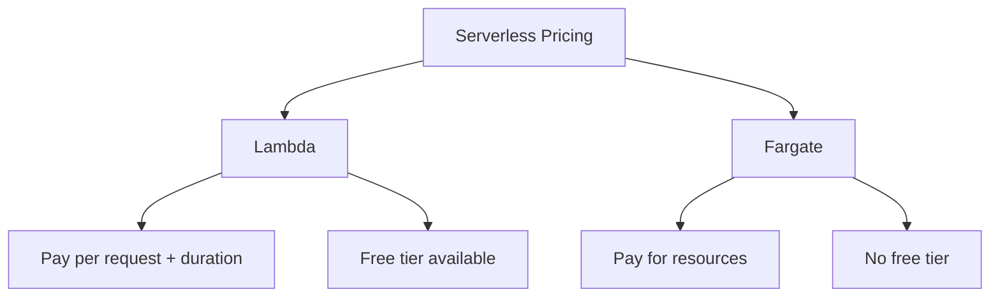

#Serverless  #Pricing
# Lambda Features

## 💻 Supported Languages
- Java
- Go  
- PowerShell
- Node.js
- C#
- Python
- Ruby

## ⚙️ Key Features
> [!info]
> - Flexible development environments
> - Console coding support
> - Event-driven execution
> - 15-minute maximum timeout (default: 3 seconds)

## 🔐 Responsibility Model
- **You are responsible for:**
  - Code
  - Code security
- **AWS manages:**
  - Coding environment
  - Language support/versions

# 💰 Pricing Models

## Lambda Pricing
> [!tip]
> **Pricing Components:**
> - Number of requests
> - Duration (rounded to nearest millisecond)
> - Charges begin at function invocation
> - Testing is included in charges
> 
> **Free Tier:**
> - Part of Always Free tier
> - 1 million free requests per month
> - Continues after first year

## Fargate Pricing
> [!important]
> **Cost Structure:**
> - No upfront costs
> - Pay-as-you-go model
> - Based on:
>   - vCPU usage
>   - Memory usage
>   - Storage usage
> - No free tier available

# 📝 Exam Tips
> [!note]
> Remember:
> 1. **Lambda:**
>    - Always Free tier includes 1M requests/month
>    - Continues beyond first year
> 
> 2. **Fargate:**
>    - No upfront costs
>    - Pay for what you use (vCPU/memory/storage)
>    - No free tier option

# 💡 Quick Reference

---
*Notes Last Updated: 2025-02-14 14:41*